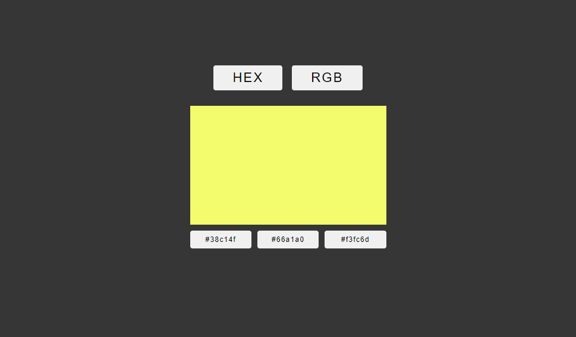

# Color Game

In the game, you must select the correct color shown on the screen (hex or rgb depending on the mode). Made with typescript.

- [Live site](https://jeda777.github.io/color-game-typescript/)

## Screenshot

